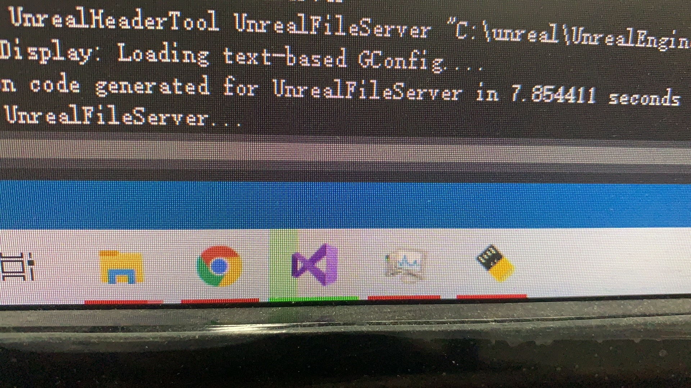

# 腾讯UE4公开课第一次作业
- 编译UE4引擎，创建工程并生成APK的整个过程。

## 引擎目录截图
- 

## 编译过程截图
- 

## ADB调试截图
- 

## 生成APK以及演示视频
- 生成的APK放在./apk中。
- [apk地址](apk/Android_ETC2/demo_zhongqian-armv7.7z.001)
- [演示视频](6102f85d3432b980748a0512b818e6d0.mp4)

### 视频
<video id="video" controls="" preload="none" poster="封面">
      <source id="mp4" src="6102f85d3432b980748a0512b818e6d0.mp4" type="video/mp4">
</videos>
